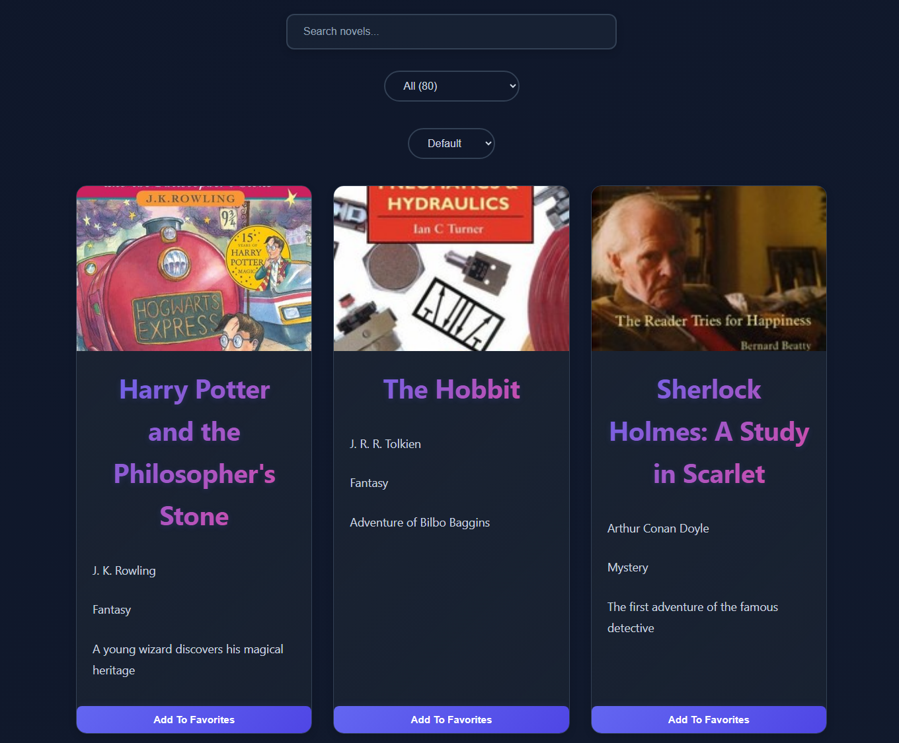

# 📚 Novel Library

A modern React application for browsing, searching, filtering, sorting, and managing favorite novels.

## 🚀 Live Demo

[View Live Demo](https://react-novel-library.vercel.app/)

## ✨ Features

* Browse a collection of novels
* Search novels by title
* Filter novels by category
* Sort novels alphabetically (A-Z / Z-A)
* Add and remove favorites
* Persist favorites using Local Storage
* Dynamic novel details pages
* Responsive design
* Custom 404 page

## 🛠️ Built With

* React
* React Router DOM
* Vite
* JavaScript (ES6+)
* CSS3
* Local Storage API

## 📂 Project Structure

```text
src/
├── components/
├── pages/
├── hooks/
├── layouts/
├── data/
├── App.jsx
└── main.jsx
```

## 📸 Screenshots

You can add screenshots of the application here.

## ⚙️ Installation

Clone the repository:

```bash
git clone https://github.com/Zakaria-thabet-ahmed99/react-novel-library.git
```

Navigate to the project folder:

```bash
cd react-novel-library
```

Install dependencies:

```bash
npm install
```

Run the development server:

```bash
npm run dev
```

Build for production:

```bash
npm run build
```

## 🎯 Learning Goals

This project was built to practice:

* React Components
* Props
* State Management
* Custom Hooks
* React Router
* Conditional Rendering
* Local Storage
* Project Structure
* Deployment with Vercel

## 👨‍💻 Author

Zakaria Thabet Ahmed

GitHub:
[Zakaria-thabet-ahmed99](https://github.com/Zakaria-thabet-ahmed99)

## 📸 Preview


